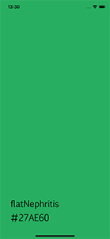

# FlatUIColors

[](https://travis-ci.org/alberto.pasca@gmail.com/FlatUIColors)
[](https://cocoapods.org/pods/FlatUIColors)
[](https://cocoapods.org/pods/FlatUIColors)
[](https://cocoapods.org/pods/FlatUIColors)

## Example

To run the example project, clone the repo, and run `pod install` from the Example directory first.

The Example project contains a simple showcase of all colors presents. Run the project and check it.

  

### Usage

To use in your code, simply:  

1. `import FlatUIColors`  
2. Use the color as normal color: `UIColor.flatAmethist`

```
self.view.backgroundColor = UIColor.flatAmethist
```

## Requirements
- Xcode 10+
- Swift 5+

## Installation

FlatUIColors is available through [CocoaPods](https://cocoapods.org). To install
it, simply add the following line to your Podfile:

```ruby
pod 'FlatUIColors'
```

## Author

Alberto Pasca - [albertopasca.it/whiletrue](https://www.albertopasca.it/whiletrue)

## License

FlatUIColors is available under the MIT license. See the LICENSE file for more info.
